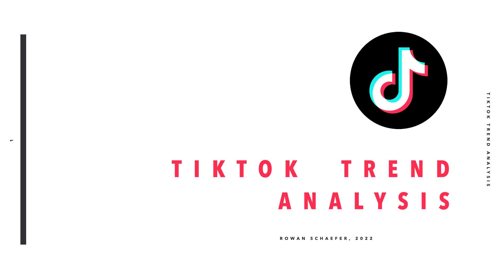

<!-- PROJECT LOGO -->
 
<!--

  -->

  <h2>TikTok Trend Analysis and Video Recommender</h2>
  <h4>Completed for General Assembly, 2022</h4>

 
<!-- ABOUT THE PROJECT -->

<!-- BACKGROUND -->
#### This app is being created to help TikTok creators monitor the top and rising songs and hashtags by country/location. This is important due to the way that TikTok algorithm selects For You Page (FYP)  content for its users in 2022.

If you're a new TikTok creator, your content will only be recommended on the For You Pages (FYP) of users in your OWN country, until you gain a minimum number of followers to be suggested internationally.

Many people have tried to find a way around this. Changing your location on Tiktok is a complicated process that involves gps spoofing, a VPN, and having sim cards for all your target countries. 

Another option is that until creators have a large enough following, they need to prioritize creating locally targeted content. 
  

(<a href="#top">back to top</a>)

 

<!-- PROBLEM STATEMENT -->
## Problem Statement
Due to the location barriers that new tiktok creators face, a solution is needed to better analyze trends in non-US countries. Currently there are no web apps that allow you to cross compare trending content in different countries. 
  

#### My intention is to design an app that could answer the following questions for a creator/business owner:

1. What are the top trending sounds in <code>country 1</code>?

2. What is the intersection of top trending sounds/hashtags in <code>country 1</code>, <code>country 2</code>, and <code>country 3</code>? 

3. Lastly, I built a recommender app to explore how content might be suggested, with the removal of the location barriers. 

 

#### Risks & assumptions:
* TikTok changes their algorithms often - so usefulness/relevancy of this information may decrease over time

* I had limited information available about the data fields that were pulled during data collection. Some inferences were made based on context and prior knowledge.

* Third party TikTok APIs break frequently and there is a good chance that the one I have used will break; code will need an overhaul eventually.

* Trends change constantly. Preprocessing steps will need to be continually re-evaluated in order for resulting analysis to hold any weight. See discussion on context for trending hashtags in the data cleaning file.

 (<a href="#top">back to top</a>) 

 

<!-- DATA -->
## Data Collection

I ended up using TikTok-All-In-One from FastAPI to collect data.  Data collection process was cut short early due to time constraints; overall 74,197 rows of data were pulled for 119 countries (A-K, with some extras.) 

Note that in the data there are a lot of extra fields that are not used. I chose to keep them around, so I could cross check and make inference about other fields. This was necessary due to not having documentation for the API.

In the future, collection for the remaining countries will need to be done with a virtual machine. 

Note that csvs in the data folder are redundant. When I update I intend to rework the collection, cleaning, and preprocessing steps for higher efficiency.

(<a href="#top">back to top</a>)

 

## Data Cleaning
Data cleaning and preprocessing steps included filling nulls, countvectorizing hashtags, and some feature enginerring (a column for FYP_location). 

Data cleaning and data collection sections need rethinking; code could be simplified across entire project by optimizing data collection. 

(<a href="#top">back to top</a>)

 

<!-- Modeling -->
## Modeling

#### Risks & assumptions:
* The modeling portion of this project is intended as exploratory.
* Even if recommending posts based on NLP alone worked well, it could actually lead to more unintended consequences than setting hard location boundaries on creators. This is a separate ethics conversation.

(<a href="#top">back to top</a>)

 

## Presentation

<a href= "https://www.icloud.com/keynote/00cOYoPPZOmZjw5gyymV5e9Aw#tiktok_trends"> 
  
click for keynote

</a>

<!-- LICENSE -->
## License

Distributed under the MIT License. See `LICENSE.txt` for more information.

(<a href="#top">back to top</a>)

 

